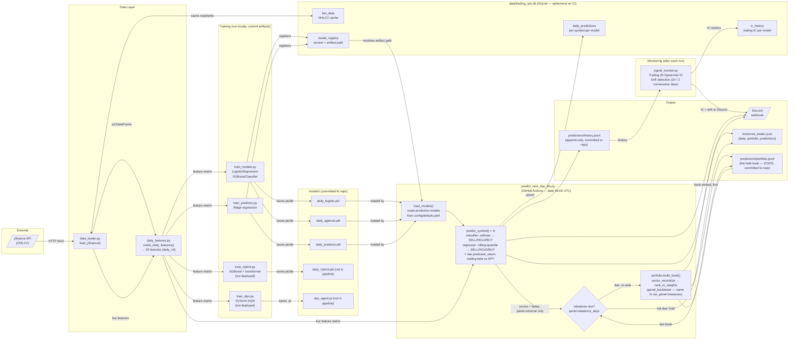

# Architecture

Trading Sim is a three-phase pipeline: **train → backtest → predict**. The diagram below shows
the data-flow for the daily live prediction path (Phase 3) and how training artifacts feed into it.
The SQLite database is a side-channel cache — it is not authoritative for predictions (that role
belongs to `predictions/history.jsonl`, which is committed to the repo and survives ephemeral CI runners).

## Component Descriptions

| Component | File | Role |
|---|---|---|
| **Data loader** | `data_loader.py` | `load_yfinance()` fetches OHLCV from yfinance; caches bars in SQLite `bar_data` table to avoid redundant fetches |
| **Feature engineering** | `daily_features.py` | `make_daily_features()` computes the 25-feature `daily_v3` vector. `FEATURE_COLS` is the canonical feature contract — changing it requires retraining all models and bumping `FEATURE_SET_NAME` |
| **Logistic/XGBoost training** | `train_models.py` | Trains 3-class classifiers on discretized SELL/HOLD/BUY targets; saves `daily_logistic.pkl` and `daily_xgboost.pkl` |
| **Predictor training** | `train_predictor.py` | Trains Ridge regression on continuous forward return target; saves `daily_predictor.pkl`; runs walk-forward param sweep via `walk_forward.sweep_params` |
| **Daily job** | `predict_next_day_lite.py` | Entry point for GitHub Actions; predicts the union of `panel.universe` and `prediction.symbols`, builds the target book, scores trailing IC, sends both to Discord |
| **Portfolio (live)** | `portfolio.py` | Ranks one cross-section into a beta-neutral long/short book and holds it for `panel.rebalance_days`. Delegates weighting to `panel_backtester` |
| **Portfolio (research)** | `panel_data.py`, `panel_backtester.py`, `panel_eval.py`, `run_panel.py` | Builds date×symbol panels, runs the book over history, and gates it on deflated Sharpe with realized beta as a precondition |
| **Decision layer (portfolio)** | `panel_backtester.rank_to_weights` + `sector_neutralize` | Single source of truth for "what do I hold". Called identically by `run_panel.py` (backtest) and `portfolio.build_book` (live) — verified identical on real data, 2026-07-30 |
| **Decision layer (per-symbol)** | `ml_strategies.compute_predictor_signal` | Single source of truth for the rolling-quantile threshold used by both `DailyPredictorStrategy` (backtest) and live prediction — the two can never silently diverge |
| **IC scoring** | `signal_monitor.py` | Computes trailing Spearman IC against realized returns from `predictions/history.jsonl`; checks for distribution drift |
| **Database** | `db.py` | SQLite layer; schema is idempotent (`CREATE TABLE IF NOT EXISTS`) so a fresh DB is safe. Ephemeral on CI — `predictions/history.jsonl` is the durable prediction record |
| **Config** | `config/default.yaml` | Single source of truth for symbol universes, model list, hyperparameters, thresholds. `prediction.models` controls which models are loaded at runtime — no code change needed to add/remove a model |

## Key Invariants

- **`FEATURE_COLS` is the feature contract.** All pickles store it under `feature_contract`; `predict_next_day_lite._load_pkl` raises `RuntimeError` on mismatch. Never change `FEATURE_COLS` without bumping `FEATURE_SET_NAME` and retraining all models.
- **`compute_predictor_signal` is the single per-symbol decision layer.** It is called identically in backtest (`DailyPredictorStrategy.signal`) and live prediction (`predict_next_day_lite._predict_regressor_signal`). Do not duplicate it.
- **`rank_to_weights` is the single portfolio decision layer.** `portfolio.build_book` calls it rather than reimplementing ranking, so the published book equals the backtested one by construction. Do not add live-only adjustments — including risk clamps. A book that differs from the measured book has no measurement behind it; flag and report instead (`portfolio.NET_EXPOSURE_WARN`).
- **`predictions/portfolio.jsonl` is state, not a log.** It holds the current book between rebalances. Deleting it forces a rebalance from scratch, which the walk-forward prices at 1.4–2.7 Sharpe a year in turnover cost. `simulation.yaml` commits it back after every scheduled run.
- **ETFs never enter `panel.universe`.** They are baskets of the ranked names; ranking a stock against a fund that holds it is not a cross-sectional bet. Enforced by `tests/test_config.py::test_panel_universe_is_stocks_only`.
- **`predictions/history.jsonl` is append-only.** It is the only durable record of what the live models predicted (the SQLite `daily_predictions` table is ephemeral on CI runners). Committed to the repo after every scheduled run by `simulation.yaml`.
